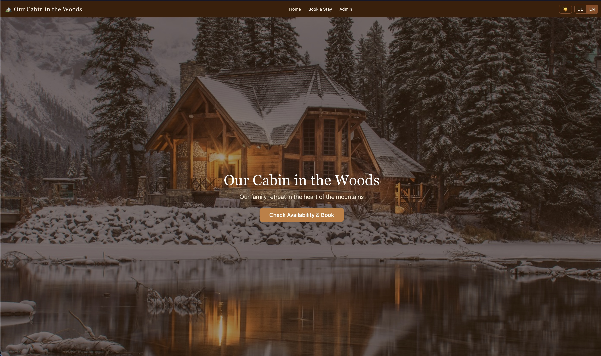
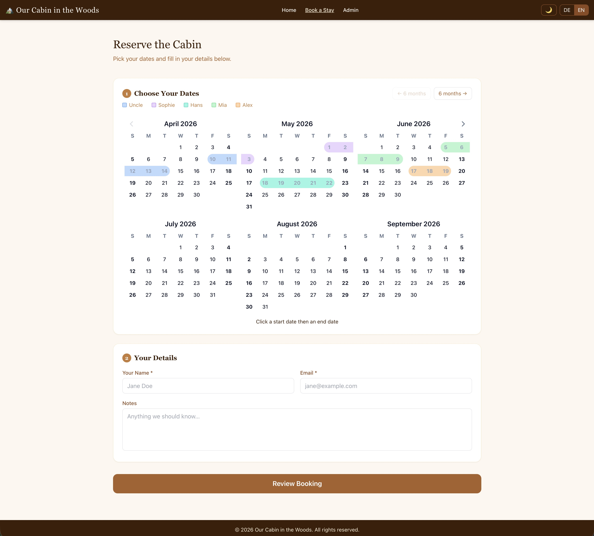
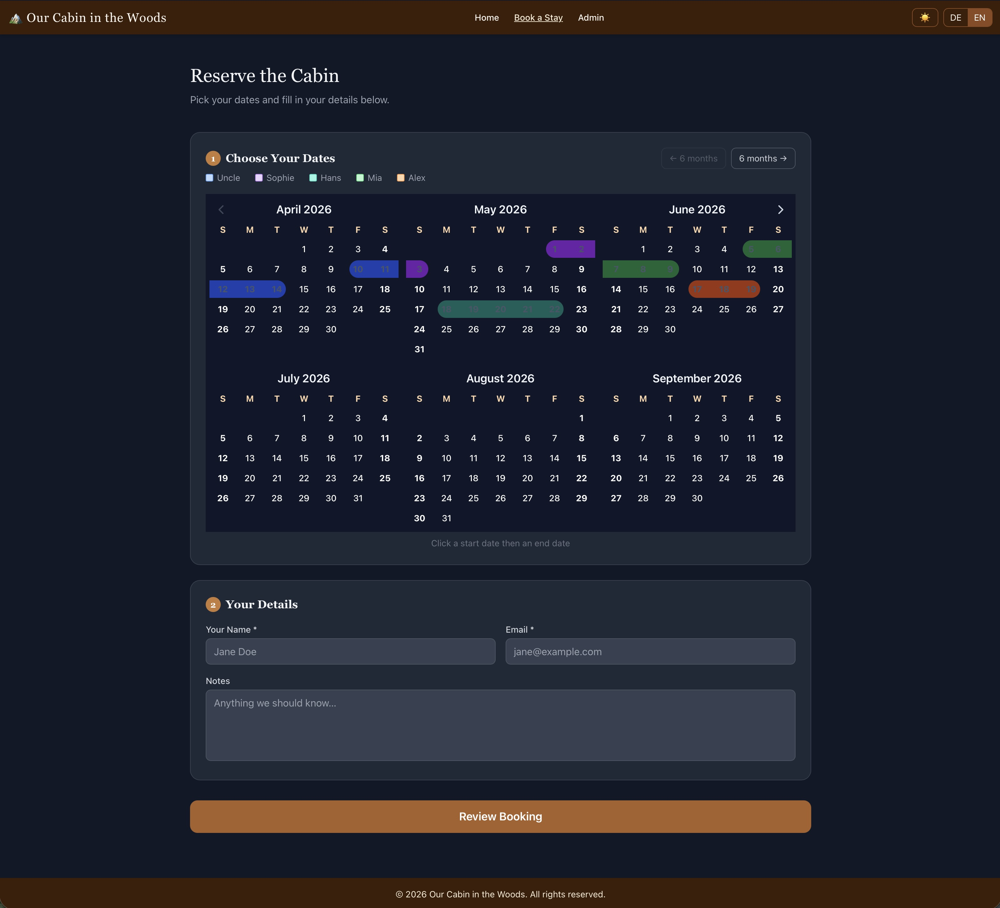
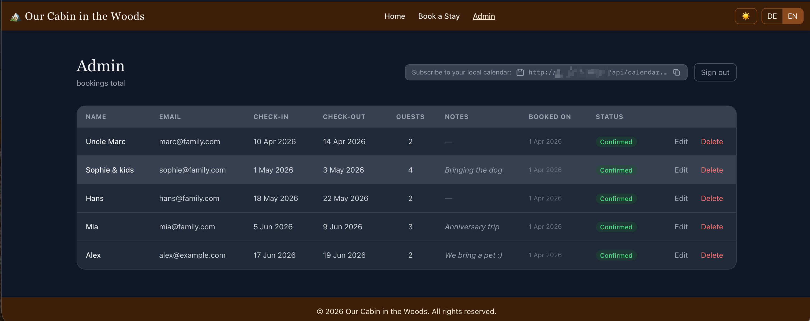

# Simple Booking App

A self-hosted booking system for a private cabin, chalet, or any shared space. Guests can browse availability, request a stay, and receive email confirmations. An admin reviews and approves or declines requests via a password-protected dashboard.

---

## Features

### For guests
- **Availability calendar** — color-coded per person, showing who has booked which dates; pending (unconfirmed) bookings are shown with a striped pattern; back-to-back bookings share a boundary day with a split visual
- **Multi-step booking form** — pick dates, fill in name, email and optional notes
- **Minimum stay** enforced on both frontend and backend — configurable via `MIN_STAY` (default: 2 nights)
- **Branded email notifications** — guests receive a "request received" email immediately, and a confirmation or decline email once the admin acts; all emails are sent in the guest's language (EN/DE)
- **Self-service cancellation** — every confirmation email contains a personal cancel link; no account needed
- **Trusted email allowlist** — email addresses listed in `TRUSTED_EMAILS` are auto-confirmed without admin review
- **Dark mode** support
- **English / German** interface (auto-detected, switchable)

### For admins
- **Password-protected dashboard** at `/admin`
- **Approve or decline** pending bookings; when declining, an optional reason can be entered and is included in the email sent to the guest
- **Edit or delete** any booking directly from the dashboard
- **Booking history** — declined and cancelled bookings are preserved in a collapsible history section rather than deleted; decline reasons are shown
- **Status badges** — bookings are shown as Pending (amber) or Confirmed (green)
- **iCalendar feed** — subscribe to `/api/calendar.ics` in any calendar app for live sync; checkout day is included in each event so back-to-back bookings display correctly; event titles support a configurable prefix via `CALENDAR_PREFIX`

### Technical
- Conflict detection — overlapping dates are rejected at the API level; back-to-back bookings sharing a checkout/check-in day are explicitly allowed
- Locale persisted on each booking — admin-triggered emails (approve, decline) are always sent in the guest's original language
- Email delivery via [Resend](https://resend.com) with configurable sender name (`FROM_NAME`)
- SQLite database — simple, zero-config, file-based; schema migrations run automatically on startup
- JWT-based admin authentication (7-day tokens)
- Structured logging via [pino](https://getpino.io) — human-readable with timestamps and client IPs in all environments

---

## Screenshots

| Home | Booking |
|---|---|
|  |  |

| Dark mode | Admin dashboard |
|---|---|
|  |  |

---

## Tech stack

| Layer | Technology |
|---|---|
| Frontend | Vue 3, Vite, Tailwind CSS, vue-i18n, Pinia, v-calendar |
| Backend | Node.js, Express 5, TypeScript (tsx) |
| Database | SQLite via better-sqlite3 |
| Email | Resend |
| Auth | JWT |

---

## Configuration

Create a `.env` file in the project root (never commit this — use `.env.example` as a template):

```env
# App name — appears in the UI, browser tab, and all outgoing emails.
# Both lines must be set to the same value. This is a technical requirement:
# the backend (Node.js) reads APP_NAME, and the frontend build tool (Vite)
# only exposes variables prefixed with VITE_ to the browser.
APP_NAME=My Cabin
VITE_APP_NAME=My Cabin

# Resend API key — get one at https://resend.com
RESEND_API_KEY=re_your_key_here

# Where admin notification emails are sent
ADMIN_EMAIL=admin@example.com

# The "from" address on all outgoing emails
FROM_EMAIL=noreply@yourcabin.com

# Friendly sender name shown in email clients (defaults to APP_NAME if not set)
FROM_NAME=My Cabin

# Password for the /admin dashboard
ADMIN_PASSWORD=changeme

# Secret used to sign JWT tokens
JWT_SECRET=change-this-to-a-long-random-string

# Public URL of the app — used to generate cancel links in emails
APP_URL=https://yourcabin.com

# Comma-separated list of email addresses that are auto-confirmed without admin approval
# Leave empty to require approval for everyone
TRUSTED_EMAILS=alice@example.com,bob@example.com

# Secret token to protect the iCal feed — append ?token=<value> when subscribing
# Leave empty to make the feed public (not recommended)
CALENDAR_TOKEN=change-this-to-a-random-string

# Optional prefix for calendar event titles (e.g. "🏡" or "Cabin:")
CALENDAR_PREFIX=🏡

# Port the backend listens on (default: 3001)
PORT=3001

# Domain name — used by nginx and SSL certificate
DOMAIN=yourcabin.com

# Email for Let's Encrypt expiry notifications
CERTBOT_EMAIL=you@example.com

# Log level: trace | debug | info | warn | error (default: info)
LOG_LEVEL=info

# How long each hero background image is shown in milliseconds (default: 6000)
VITE_BG_INTERVAL=6000
```

### Hero background images

Drop any number of images (jpg, jpeg, png, webp) into the `data/backgrounds/` folder — they are served and rotated automatically with no config or rebuild required. The rotation interval is configurable via `VITE_BG_INTERVAL` (milliseconds, default 6000). If the folder is empty, a single fallback image is used:

- Drop a `bg.jpeg` (or `bg.jpg`) into `data/` as the fallback image
- If no fallback is present either, a default landscape photo is shown

**Without Docker:** place images in `data/backgrounds/` in the project root
**With Docker:** place images in `./data/backgrounds/` on the server (same volume as the database)

---

## Installation — without Docker

### Requirements
- Node.js 20+
- npm

### Development

```bash
git clone https://github.com/yourname/simple-booking-app.git 
cd simple-booking-app
npm install
cp .env.example .env   # then fill in your values
npm run dev
```

The app is available at `http://localhost:5173`. The backend API runs on port 3001 and is proxied automatically by Vite.

### Production (on a server)

**1. Install dependencies and build the frontend:**
```bash
npm install
npm run build
```

**2. Start the backend with PM2:**
```bash
npm install -g pm2
NODE_ENV=production pm2 start --name cabin -- npx tsx backend/index.ts
pm2 save
pm2 startup   # follow the printed command to enable auto-start on reboot
```

**3. Configure Nginx** as a reverse proxy (`/etc/nginx/sites-available/cabin`):
```nginx
server {
    listen 80;
    server_name yourcabin.com;

    root /path/to/cabin-reserve/dist;
    index index.html;

    location / {
        try_files $uri $uri/ /index.html;
    }

    location /api/ {
        proxy_pass http://localhost:3001;
        proxy_set_header Host $host;
    }
}
```
```bash
ln -s /etc/nginx/sites-available/cabin /etc/nginx/sites-enabled/
nginx -t && systemctl reload nginx
```

**4. HTTPS with Certbot (recommended):**
```bash
apt install certbot python3-certbot-nginx
certbot --nginx -d yourcabin.com
```

**Deploying updates:**
```bash
git pull
npm install       # only if dependencies changed
npm run build     # only if frontend changed
pm2 restart cabin
```

---

## Installation — with Docker

### Requirements
- Docker and Docker Compose

### First deploy

**1. Clone the repo on the server:**
```bash
git clone https://github.com/Alex-Klein/simple-booking-app.git ~/simple-booking-app
cd simple-booking-app
```

**2. Create the `.env` file:**
```bash
cp .env.example .env
nano .env   # fill in all variables
```

**3. Obtain an SSL certificate** (your domain must already point to this server):
```bash
chmod +x scripts/init-ssl.sh
./scripts/init-ssl.sh
```

**4. Build and start:**
```bash
docker compose up -d --build
```

The app is now running on port 443 (HTTPS) with automatic HTTP → HTTPS redirect. The SQLite database is persisted in `./data/` and is never affected by redeployments.

### Deploying updates

```bash
git pull
docker compose up -d --build
```

### SSL renewal

Certificates are renewed automatically — the certbot container checks every 12 hours. To renew manually:
```bash
./scripts/renew-ssl.sh
```

### Useful commands

```bash
# View logs
docker compose logs -f

# Stop everything
docker compose down

# Open a shell inside the app container
docker compose exec app sh

# Backup the database
cp data/cabin.db data/cabin-backup-$(date +%Y%m%d).db
```

---

## Project structure

```
cabin-reserve/
├── backend/
│   ├── index.ts          # Express entry point
│   ├── db.ts             # SQLite schema and migrations
│   ├── email.ts          # Resend email functions
│   ├── middleware/
│   │   └── auth.ts       # JWT middleware
│   ├── logger.ts         # pino logger (human-readable, timestamps, client IPs)
│   └── routes/
│       ├── auth.ts       # POST /api/auth/login
│       ├── bookings.ts   # Booking CRUD + approve/decline
│       ├── cancel.ts     # Token-based self-service cancellation
│       └── calendar.ts   # GET /api/calendar.ics — iCal feed
├── src/
│   ├── views/
│   │   ├── HomeView.vue      # Hero slideshow (images auto-loaded from data/backgrounds/)
│   │   ├── BookView.vue      # Date picker + guest form
│   │   ├── ConfirmView.vue   # Review and submit
│   │   ├── CancelView.vue    # Self-service cancellation
│   │   ├── LoginView.vue
│   │   └── AdminView.vue     # Admin dashboard
│   ├── stores/
│   │   ├── booking.ts    # Booking state (Pinia)
│   │   └── auth.ts       # Auth state (Pinia)
│   └── i18n/
│       ├── en.ts
│       └── de.ts
├── nginx/
│   └── nginx.conf.template   # nginx config (DOMAIN + PORT substituted at startup)
├── scripts/
│   ├── init-ssl.sh           # First-time Let's Encrypt certificate issuance
│   └── renew-ssl.sh          # Manual certificate renewal
├── data/
│   ├── backgrounds/          # Drop slideshow images here (jpg/jpeg/png/webp)
│   ├── bg.jpg                # Fallback hero image (optional)
│   └── cabin.db              # SQLite database (auto-created)
├── Dockerfile
├── docker-compose.yml        # App + nginx + certbot
├── .env.example              # Copy to .env and fill in your values
└── .env                      # Not committed
```

---

## iCalendar feed

All confirmed bookings are available as a subscribable iCal feed:

```
https://yourcabin.com/api/calendar.ics?token=<CALENDAR_TOKEN>
```

Subscribe once in your calendar app and it will sync automatically:

- **Apple Calendar** → File → New Calendar Subscription → paste the URL
- **Google Calendar** → Other calendars → From URL → paste the URL
- **Outlook** → Add calendar → From internet → paste the URL

If `CALENDAR_TOKEN` is not set in `.env`, the feed is public (no token required).

---

## Admin access

Navigate to `/login` and enter the password set in `ADMIN_PASSWORD`. The session lasts 7 days.
